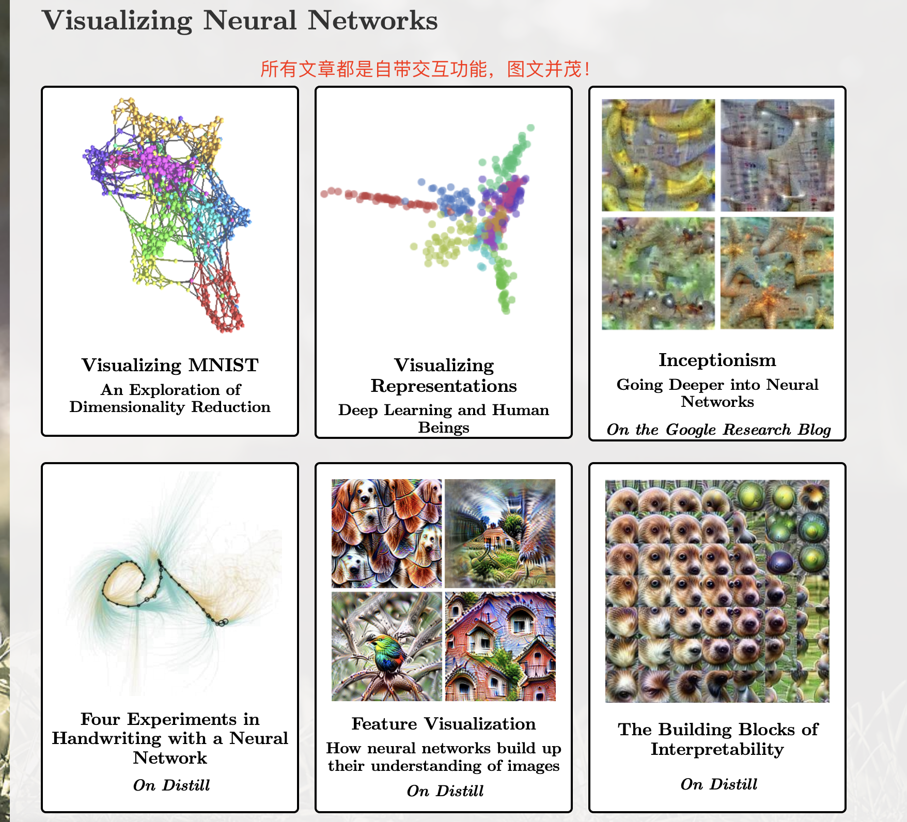

#### 深度学习

[TingsongYu/PyTorch-Tutorial-2nd: 《Pytorch实用教程》（第二版）无论是零基础入门，还是CV、NLP、LLM项目应用，或是进阶工程化部署落地，在这里都有。相信在本书的帮助下，读者将能够轻松掌握 PyTorch 的使用，成为一名优秀的深度学习工程师。](https://github.com/TingsongYu/PyTorch-Tutorial-2nd)

##### 参考PDF下载 https://github.com/TingsongYu/PyTorch-Tutorial-2nd/releases/download/v1.0.0/PyTorch.-.-v1.0-2024-0515.pdf

#### 大模型LLM

[liguodongiot/llm-action: 本项目旨在分享大模型相关技术原理以及实战经验（大模型工程化、大模型应用落地）](https://github.com/liguodongiot/llm-action?tab=readme-ov-file#llm训练)

[Distill](https://distill.pub/)

#### Distill 这个网站文章都是让机器学习研究变得清晰、动态和生动。文章是带交互的，可视化理解神经网络，非常推荐 去关注和学习。

